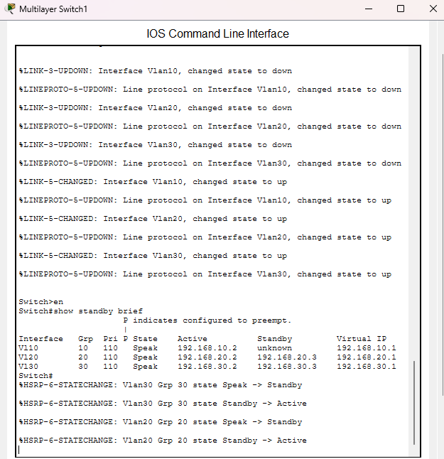
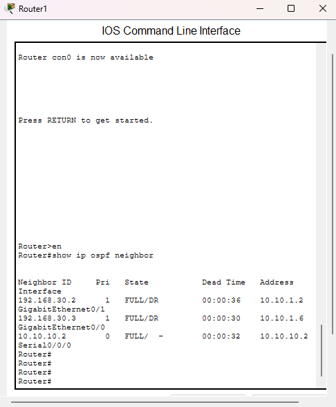
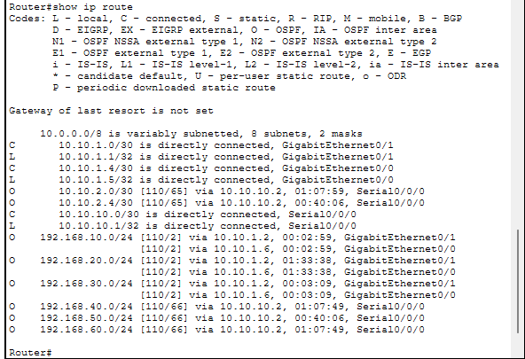
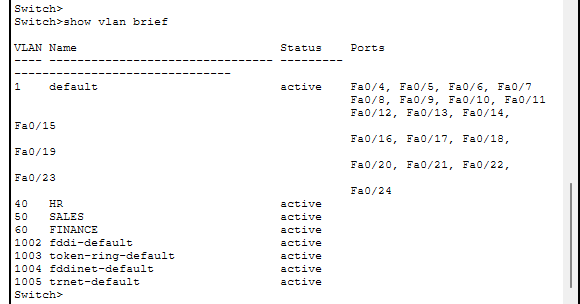
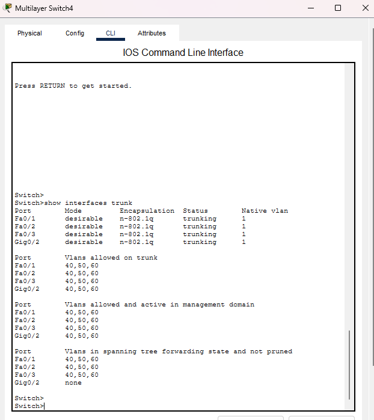
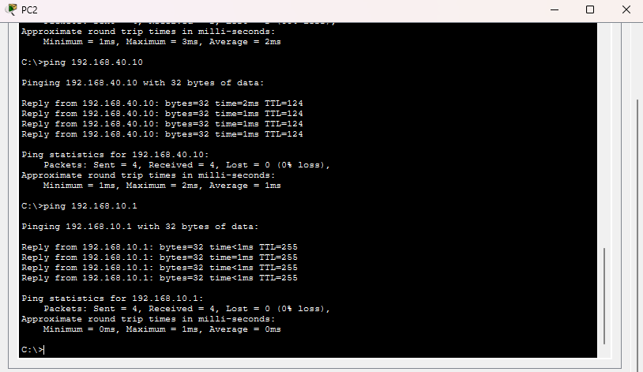

# Enterprise Network Design & High Availability Lab

## Overview

Designed and configured a multi-site enterprise network in Cisco Packet Tracer. The network simulates a headquarters and branch office environment with departmental VLAN segmentation, redundant multilayer switching, dynamic routing, and gateway redundancy.

## Network Topology

## Technologies & Concepts

- Cisco Packet Tracer
- Cisco IOS
- VLANs
- 802.1Q trunking
- Inter-VLAN routing
- Multilayer switching
- HSRP
- OSPF
- IPv4 subnetting
- Layer 3 point-to-point links
- Network redundancy
- Network troubleshooting

## Network Design

### Building 1 — Headquarters

- VLAN 10 — HR
- VLAN 20 — Sales
- VLAN 30 — Finance

### Building 2 — Branch Office

- VLAN 40 — HR
- VLAN 50 — Sales
- VLAN 60 — Finance

## High Availability

HSRP is configured between redundant multilayer switches to provide virtual default gateways and gateway redundancy for the departmental VLANs.

## Dynamic Routing

OSPF Area 0 is used to dynamically exchange routing information between Layer 3 devices and provide connectivity between the headquarters and branch office.

### OSPF Neighbor Adjacency

OSPF Area 0 dynamically exchanges routes between the headquarters and branch network. Neighbor adjacencies were verified in the FULL state.

### Routing Table Verification

The routing tables were inspected to verify dynamically learned OSPF routes to remote networks.

## Testing & Verification

### VLAN Configuration

Departmental VLANs were created to segment HR, Sales, and Finance traffic into separate broadcast domains.

### 802.1Q Trunking

Trunk links were configured between switches to transport multiple VLANs while restricting links to the required VLANs.

### Inter-Building Connectivity

End-to-end ICMP testing verified connectivity between hosts located at the headquarters and branch office across the routed network.

`Enterprise-Network-Design-Lab.pkt`
