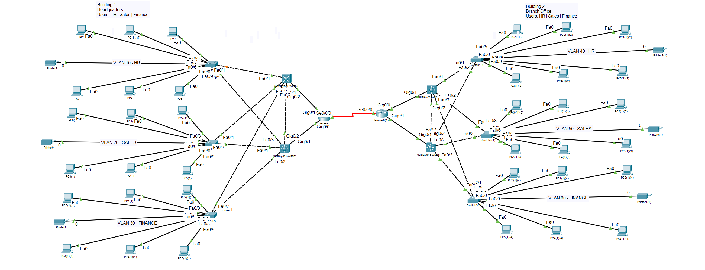

# Enterprise Network Design & High Availability Lab

## Overview

Designed and configured a multi-site enterprise network in Cisco Packet Tracer. The network simulates a headquarters and branch office environment with departmental VLAN segmentation, redundant multilayer switching, dynamic routing, and gateway redundancy.

## Network Topology

## Technologies & Concepts

- Cisco Packet Tracer
- Cisco IOS
- VLANs
- 802.1Q trunking
- Inter-VLAN routing
- Multilayer switching
- HSRP
- OSPF
- IPv4 subnetting
- Layer 3 point-to-point links
- Network redundancy
- Network troubleshooting

## Network Design

### Building 1 — Headquarters

- VLAN 10 — HR
- VLAN 20 — Sales
- VLAN 30 — Finance

### Building 2 — Branch Office

- VLAN 40 — HR
- VLAN 50 — Sales
- VLAN 60 — Finance

## High Availability

HSRP is configured between redundant multilayer switches to provide virtual default gateways and gateway redundancy for the departmental VLANs.

## Dynamic Routing

OSPF Area 0 is used to dynamically exchange routing information between Layer 3 devices and provide connectivity between the headquarters and branch office.

## Verification

The network was tested for:

- Default gateway connectivity
- Inter-VLAN connectivity
- Inter-building connectivity
- OSPF neighbor adjacency
- HSRP operation and redundancy
- 802.1Q trunk operation

## Project File

The complete Cisco Packet Tracer topology is available in:

`Enterprise-Network-Design-Lab.pkt`
